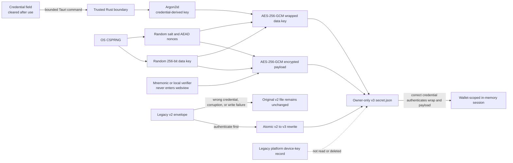

# Groot architecture

## Diagnostic boundary

ADR 0066 tightens the existing Mainnet setup-copy path for multisig creation:
an explicitly selected source must pass the native exact-chain recheck and
credential re-encryption before registry publication, or the candidate rolls
back with its public draft intact. An existing-wallet adoption marks its newly
loaded node-auth session verified after that same preflight. The Policy route
loads its public first-address reference separately from database-gated policy,
health, and snapshot reads; an offline status failure cannot be misreported as
an HWI identity failure. Persisted representations and signer identity checks
are unchanged.

The native boundary owns an app-scoped `diagnostics-v1.jsonl` file separate from
wallet databases and registry state. Call sites select closed event/outcome enums;
the renderer cannot submit log messages or context. Fixed scalar metadata and a
stable-error allowlist are serialized before IPC, with unknown errors reduced to
`internal_error`. Allowlisted failures may add a fixed safe explanation and closed,
operation-specific numeric details; arbitrary native/RPC/device messages remain
excluded. Settings owns the only normal navigation entry, immediately before
wallet deletion, while the unlocked desktop rail or mobile tabs remain present on the
utility route. The route reads only this sanitized file. Renderer-local search,
closed-enum event/outcome multi-filtering, stable date ordering, table/raw-JSON presentation, and
explicit bounded clipboard copy operate only on those returned records. Native save
dialogs export deterministic JSON or CSV. ADR 0058 defines the event-selection
heuristic, prohibited data classes, append-only size bound, and compatibility
decision; ADR 0059 supersedes only its shell-presentation choice, and ADR 0060 defines
structured failure context.

Brand adoption and the intentionally stable storage namespace are recorded in [`groot-rename-audit.md`](groot-rename-audit.md) and ADR 0023.

## Product boundary

Groot is an onchain-only Bitcoin wallet and multisig coordinator for desktop, iOS, and Android. The first functional build targets local regtest. Signet is the next remote integration network and Testnet4 is the final public-network rehearsal. Browser-only development uses deterministic dummy data; a compile-time composition-root flag selects the real Rust adapter for Tauri bundles and lets the native build exclude the dummy implementation.

## Stack

- **Shell:** Tauri v2, using the shared Rust library entry point required by desktop and mobile.
- **Frontend:** SvelteKit in SPA mode with `adapter-static`; Svelte 5 and local shadcn-svelte-style primitives.
- **Release profile:** Native release bundles use ThinLTO, one code-generation unit, and stripped symbols while retaining Cargo's normal runtime-oriented optimization level. Debug and test profiles are unchanged.
- **Wallet core:** Rust with `bdk_wallet` and its pinned Miniscript dependency, 24-word BIP39 recovery, BIP84 single-key descriptors, BIP48 `wsh(sortedmulti(...))` multisig descriptors, PSBTs, and SQLite persistence.
- **Hardware boundary:** Bitcoin Core HWI is behind `HardwareTransport` and is never searched through `PATH`. A distributed macOS build resolves only the exact reviewed HWI resource inside its own `.app`, requires its compiled SHA-256 and code signature, and verifies the containing app's sealed code signature before every spawn. Production package verification additionally requires the expected matching Developer ID team, hardened runtime, secure timestamps, and the reviewed HWI-only library-validation exception. Ad-hoc identity is Testnet4 development evidence only. Regtest permits an explicit external developer installation for physical certification. An external public-network Unix build requires the pinned digest plus root ownership and non-writable path ancestry. Other production platforms fail closed until an equivalent packaged signature boundary exists. The process environment is cleared and only canonical `HOME` is restored for BitBox pairing. Native HWI discovery rejects unlisted families. A future mainnet build accepts only approved exact model identifiers, except ADR 0054's explicit `coldcard`/`coldcard` and `jade`/`jade` family records; physical evidence and support claims remain specific to Coldcard Mk4 and Jade Classic. Native HWI processes are single-flight so concurrent screens cannot compete for one USB session; aggregate discovery has a 90-second absolute bound and explicit on-device review has a five-minute bound because HWI 3.2.0 can start BitBox password entry before aggregate enumeration returns and may request it again when the isolated selected-device connection opens. Commands retain fixed argument boundaries, bounded concurrent output, exact fingerprint checks, and bounded zeroized Trezor PIN stdin. ADRs 0039, 0043, 0052, and 0054 record the packaging, interactive-discovery, and first-mainnet model boundaries.
- **Node transport boundary:** local Core is loopback-only, direct remote Core is HTTPS-only with platform-native certificate validation, and onion Core accepts only an HTTP v3 onion through a numeric loopback SOCKS5 proxy. Groot writes the onion hostname into the SOCKS5 domain request without invoking host DNS, bounds connection and I/O time, caps HTTP/JSON-RPC input, rejects ambiguous framing, and never falls back from Tor or TLS to a direct or alternate backend. A mainnet database open that reads wallet or chain state additionally requires a Rust-owned permit derived from an authenticated exact-genesis Core preflight over either loopback HTTP or direct HTTPS; the renderer cannot construct the permit. Offline exact-identity checks may open an existing database read-only to compare its already-stored public descriptors, but cannot read balance, history, proposals, or chain state. Existing wallets first authenticate with only their wallet credential, decrypt their exact saved Core setup in Rust, and run the preflight from Overview before the first wallet-data read; a session is eligible for a permit only after that check succeeds. Each saved per-wallet RPC password is encrypted together with the complete validated node route and authentication configuration; use requires an exact match with the public settings both at unlock and request time. An unlocked wallet may provide that setup to another unlocked wallet through one native adoption command. Rust verifies the destination credential, requires an exact live source authentication session, rechecks the compiled chain, and re-encrypts the password for the destination UUID without returning it to the webview. This copies existing per-wallet files rather than introducing a shared secret or global mutable connection. An untouched default node configuration has no saved password and does not block wallet unlock; a saved username/password configuration with a missing encrypted secret fails closed as corrupt and requires explicit reconnection. The idempotent selected-wallet node-health sequence retries only its sanitized transient transport result once with a short bounded pause; saved-credential RPC health uses an eight-second timeout, while ordinary wallet RPC keeps its existing limit; chain mismatch and RPC-policy errors are not retried. Broadcast independently checks chain identity immediately before submitting the transaction.
- **Authentication database exception:** In the preceding node-boundary rule, “database open” means an open that can read wallet data. PIN throttling must remain restart-resistant and must run before a credential can decrypt the saved Core secret. A distinct short-lived native permit therefore opens the selected regular database only for `groot_auth_throttle`; this opener performs no general schema initialization, cannot satisfy a wallet-data opener, and returns no database content to the renderer. Overview still verifies the saved Core route before balances, history, descriptors, proposals, or other wallet state are read.
- **Current chain sources:** Bitcoin Core RPC remains the per-wallet default. An explicit per-wallet compact-filter source uses `bdk_kyoto` for verified BIP157/BIP158 confirmed-activity discovery. Network-setup adoption copies only that source preference and its public peer/proxy configuration; it never copies wallet checkpoints, matches, labels, history, or scan progress. The overview starts that scan after loading durable wallet state and polls a sanitized native status DTO: connection counts, Kyoto's weighted overall percentage, public chain height, match checking, atomic application, completion, or failure with the last verified wallet height. Peer addresses, block hashes, raw warnings, scripts, and descriptors never enter the DTO. Network fetching finishes before Groot opens the write transaction; the completed BDK update, observed-address state, provenance, notification baseline/events, and wallet changeset then commit atomically. Groot reserves one owner-only public working directory per compiled network, but pinned `bip157` 0.6.3 currently ignores its configured data directory and keeps headers/filters in memory; no durable shared-cache or cache-repair claim is made, and the UI discloses that public filters are downloaded again after app restart. Wallet checkpoints, scripts, matches, labels, and the BDK graph remain durable and isolated in the wallet database. The Core `groot-dev` wallet is only a faucet/miner and never owns Groot keys. ADR 0032 records the certification boundary and upstream limits.
- **Process boundary:** native startup acquires an operating-system file lock for the exact resolved application-data directory before exposing wallet commands and retains it for the process lifetime. A second Groot process targeting the same registry and wallet databases fails closed; profiles using distinct explicitly isolated regtest directories remain independent. The persistent lock file is owner-only on Unix and never deleted or replaced; Unix revalidates its device/inode, Windows denies delete sharing while the handle is open, and the kernel releases the lock after normal exit or a crash.
- **Network boundary:** `ChainBackend` configures the explicit Core fee/broadcast/mempool service; `WalletSyncSource` separately selects Core or compact-filter confirmed discovery. Local Core is loopback-only. Direct remote Core requires HTTPS; `.onion` Core may use HTTP only through an explicit loopback SOCKS5 proxy. URL credentials, non-loopback proxies, and onion URLs without Tor are rejected. Compact-filter public discovery requires at least two peers outside Regtest. Manual mode never falls back to DNS seeds; proxy mode additionally rejects discovery and hostname peers because the pinned Kyoto stack otherwise performs local DNS. User/password secrets use the wallet's portable credential-encrypted store and exist in memory only for the unlocked wallet session. Esplora remains deliberately unwired.
- **Interchange boundary:** `bsms.rs` accepts bounded public BIP129/BSMS descriptor records plus narrowly defined public descriptor text (BIP-389 multipath, explicit receive/change pairs, and standard receive-only exports). It rejects private material and conflicting branches, verifies descriptor checksums when supplied, reconstructs only the standard `/1/*` change branch, and lets the wallet boundary enforce the compiled network and derive the first address. `ur_transport.rs` owns bounded Blockchain Commons UR v2 `crypto-psbt` encoding/decoding, parses the complete BIP174 payload before returning it to the webview, and does not accept secret-bearing UR types.
- **External-signer boundary:** `external_signer.rs` is the canonical parser and descriptor compiler for threshold-one hardware wallets. It accepts bounded public BIP84 material, constructs checksummed external/change descriptors, and rejects private or ambiguous data. A public receive-descriptor export requires fresh Rust-side app-PIN verification and uses the bounded native save boundary; re-import deterministically reconstructs both branches. Spending is persisted-PSBT only; HWI and file signatures pass through the same proposal verifier before broadcast.
- **Secrets and entropy:** software-wallet creation requests one 32-byte buffer directly from Rust `OsRng`; bounded supplemental transcripts can mix with but never replace OS entropy. Secret buffers use RAII zeroizing storage from acquisition across fallible return paths. A separate AES-256-GCM data key encrypts the mnemonic or local verifier, and Argon2id derives the credential key that wraps it. Version-3 profiles do not depend on a platform Keychain or device key and are portable across supported systems. Theft of the encrypted profile permits offline credential guessing, so new software wallets require at least 16 Unicode passphrase characters, while reviewed Argon2id calibration, full-disk encryption, and host security remain explicit defense-in-depth requirements. Recovery and existing-wallet operations preserve exact historical passphrases. Native recovery bounds UTF-8 input before copying it into Rust, uses zeroizing Rust storage, and clears its AppKit field on cancellation or transfer.

### Portable secret-envelope flow

The credential crosses the bounded Tauri command boundary only for the requested operation; the frontend clears its field afterward. The decrypted wallet secret exists only inside trusted Rust. The encrypted profile can be backed up or moved, but possession of it enables offline credential guessing and is therefore security-sensitive.

## Trust boundary

Mainnet HWI import admission is memory-only and bound to the exact live family,
fingerprint, account xpub, and derivation path. Device discovery invalidates
only opaque scan capabilities and preserves other still-valid admissions in a
multisig draft. A live policy/address proof renews only that signer. Leaving
setup, cancellation, restart, and expiry clear admissions. Standard multisig
creation may nevertheless commit a validated **watch-only** profile from its
public saved draft: no transient admission is interpreted as durable proof.
Rust gates newly issued Mainnet multisig receive addresses on a threshold of
persisted, descriptor-matching interactive policy/first-address proofs and all
Coldcard file-import acknowledgements; unsupported quorums fail closed. The
existing live-admission rule remains for external-signer creation and Mainnet
recovery import. Public descriptor export still permits out-of-app address
derivation, so the in-app receive gate does not replace independent device
comparison. See ADR 0065.

The webview may receive addresses, balances, transactions, UTXOs, public descriptors, public cosigner metadata, PSBT summaries, and status events. It must never receive a generated, re-presented, or recovered mnemonic, seed, extended private key, private descriptor, or decrypted signing material. Production onboarding displays generated words through a platform-native backup sheet attached to the Groot window and the command returns no secret. Deferred backup re-presentation requires fresh authentication, decrypts in Rust, reuses the native privacy gate and backup sheet, and returns only whether the subsequent native proof succeeded. Software recovery likewise collects the 24 words in a native sheet and passes them directly to Rust wallet construction; platforms without that native boundary fail closed. Browser-only deterministic fixtures are the explicit test exception.

Immediately before software signing or external-signer/multisig final broadcast, Rust reloads the exact persisted proposal and re-derives release recipient/count/amount policy from its PSBT, rejects every frozen input, and re-proves an RBF replacement's original external recipient and value. CPFP is validated as a distinct wallet-owned fee child. Every successful broadcast then applies the exact signed transaction to BDK as unconfirmed and persists it atomically with proposal status, permanent intent binding, replacement lineage, and the broadcast notification. The returned snapshot therefore includes Groot's own pending spend even when compact-filter mode cannot discover arbitrary mempool activity or the best-effort follow-up sync fails. A restart test reloads that pending transaction from SQLite. Successful RBF broadcast also persists public original-to-replacement lineage. Rust reconciles that intent with BDK's current canonical graph into one payment DTO: the replacement is the representative when it is canonical or still the broadcast candidate, while a confirmed original becomes the representative if it wins the race. The DTO carries an additive, non-persisted RBF-history view with both public identifiers, authoritative available rates, and the outcome so Overview and Activity do not double-count while transaction details retain the full timeline. Persisted broadcast lineage never overrides later chain truth.

Policy family is authoritative at the Rust hardware boundary. Standard BIP48
`wsh(sortedmulti())` may use the reviewed HWI subprocess adapters. Recovery and
Inheritance descriptors fail with `hardware_policy_unsupported` before
discovery, address display, policy registration, or signing. The renderer hides
those USB actions but is not the security boundary. Existing delayed wallets
continue through the persisted offline PSBT paths without a format change. See
ADR 0044.

## Rust command surface

During a foreground Bitcoin Core refresh, the BDK block/mempool update stays in memory until its single database commit. Overview, Activity, and full single-key/multisig snapshots may read the last committed wallet version through a separately authenticated, read-only SQLite connection instead of waiting behind remote RPC calls. A read/write gate prevents the final commit until those readers finish; descriptor and unlock-session checks run before and after each result, and provenance reconciliation is deferred to the writer. Recovery scans, compact-filter application, proposal mutation, and all other writes retain the serialized operation lock. Core mempool transaction retrieval is prefetched in bounded 32-request JSON-RPC batches, aligned to the first transaction BDK actually requests; batch transport rejection falls back to the existing single-request path. The batch cache is discarded as the ordered scan advances, so it does not retain a full node mempool. A 99% block-progress display still means pending-transaction reconciliation is underway, not that the wallet is fully current.

Receive-address and payment-proposal creation commands accept an ordered array of one to five
permanent labels. Schema v3 retains the first label in the existing primary assignment and legacy
DTO field, and stores later labels in an additive assignment table. DTOs return both the primary
field and complete ordered label set so older releases remain rollback-compatible without losing
the additional table. Existing and provenance-derived records may expose more than five labels; the
cap applies only to new explicit drafts. See ADRs 0046 and 0047.

The Tauri registration surface is grouped by ownership under `src-tauri/src/wallet/`: profile/node/recovery commands, hardware/external-signer commands, multisig setup/recovery commands, multisig proposal/signing commands, single-key/acceleration transaction commands, and native public-backup/PSBT/PDF file-export commands. `wallet.rs` retains shared authenticated persistence and transaction invariants; command modules remain thin orchestration over those helpers, while `wallet/export_commands.rs` owns only bounded user-mediated public-file output and ephemeral reveal/save capabilities. Stable domain, storage, network, transaction, and hardware error translation is centralized in the pure `wallet/error_translation.rs` boundary, without access to application state or persistence. Recovery-scan records and recovery-gap enforcement live in the private `wallet/recovery_scan.rs` persistence seam; append-only address and signer evidence lives in `wallet/verification_evidence.rs`. These extractions remain below the same authenticated Rust boundary and change no wallet, profile, proposal, registry, backup, or network-settings format. The large wallet regression suite and manual performance harness are separate sibling test modules. Platform-native recovery UI keeps its cross-platform contract in `native_backup.rs` while macOS Objective-C bindings live in `native_backup/macos.rs`.

The single-key regtest surface adds `wallet_profiles` and `wallet_select`. `wallet_generate_mnemonic` performs native presentation and returns only verification state; `wallet_reveal_and_verify_backup` freshly authenticates, performs native re-presentation and proof, and likewise returns only verification state; `wallet_create(name, credential)` consumes the Rust pending session. The remaining surface includes `wallet_exists`, `wallet_verify_backup`, `wallet_recover`, `wallet_unlock`, `wallet_lock`, credential-confirmed `wallet_delete`, `wallet_snapshot`, `wallet_sync`, non-blocking `wallet_sync_status`, `address_create(label)`, `address_discard(id)`, `coin_set_frozen(outpoint, frozen)`, `fees_estimate`, `tx_prepare(..., coin_selection)`, and `tx_sign_and_broadcast(passphrase)`. Core connection tests additionally report whether the selected local or remote node is pruned, its prune height, IBD state, reported chain disk use, and basic block-filter index state. Groot's Core RPC activity scan reads retained blocks and the mempool directly and does not require `blockfilterindex`; a pruned node is sufficient only while it retains every block needed after the wallet checkpoint, and an older explicit recovery scan requires a node with that history. Normal Core sync loads the persisted wallet, stages hostile block and mempool responses only in memory while reporting bounded public progress, then opens a short SQLite transaction for BDK state, observed addresses, provenance, notification markers, and the authoritative snapshot. Live sync still coalesces overlapping wake-ups; consecutive failures back off from the normal ten-second cadence up to five minutes and reset after success or an explicit restart. Core connection tests, node-configuration saves, wallet selection, active single-key and multisig proposal reads, saved hardware-health reads, multisig policy-verification reads, notification reads and acknowledgements, software/multisig/external-signer final broadcast commands, and both Core scan variants execute blocking RPC, serialized-lock waits, and SQLite work on Tauri's blocking worker pool so a slow node, broadcast refresh, or first historical scan cannot stall the native window event loop or race database-open maintenance. Wallet selection and network-setup adoption cancel an active foreground scan before waiting for the serialized wallet-operation lock, then continue only after that scan exits.

The descriptor coordinator surface adds hardware enumerate/readiness/PIN-matrix/xpub/sign/address-display verification commands and `hardware_check_cosigner`; multisig preview/create/snapshot/sync/address commands; persisted proposal prepare/list/import/cancel/finalize/broadcast commands; BSMS/Groot descriptor export, drill, recovery and delete; bounded UR PSBT encode/decode commands; and native public-backup save/print commands. Successful address-display checks append an event in the selected wallet database only after Rust has matched the connected fingerprint and exact decoded output. Each event retains the address index, signer fingerprint, device type, returned public address, and verification time; DTOs expose only the latest time and fingerprint. Public-backup saving is size and filename bounded, always user-mediated by the native save dialog, and applies owner-only file permissions on Unix. On macOS, a successful save can return the same short-lived, single-use Finder reveal capability as PSBT saving without returning the selected path. Regtest cookie authentication resolves its default node directory from the build-time repository boundary rather than the native process working directory; an explicit `GROOT_REGTEST_DIR` still takes precedence. USB health requires an exact enumerated fingerprint match; a duplicate connection identity is ambiguous and fails closed. Offline sources return only a public-record validation result. Mounted public-key JSON is bounded and checked for private material, network tpub, fingerprint, and the BIP48 account origin before the Rust policy boundary validates it again. The native boundary rejects browser-only virtual cosigners for preview, creation, recovery-policy compilation, and backup import. Preview and creation parse origin-aware tpubs and generate checksummed external/change descriptors in Rust. BDK stores receive and change descriptors separately; every database open revalidates both persisted hardware-wallet descriptors against authenticated metadata and the registry identity. The UI may synthesize a standard multipath `/<0;1>/*` descriptor only after proving that every `/0/*` occurrence maps exactly to `/1/*` and recomputing its Bitcoin Core checksum. Multisig state always routes to its separate watch-only BDK database. New multisig and acceleration PSBTs include `PSBT_GLOBAL_XPUB` entries derived from the authenticated policy so hardware wallets can reconstruct the BIP48 wallet policy. Hardware signing temporarily supplies the same entries to legacy active proposals and removes only that deterministic augmentation before the signed PSBT is merged, preserving the exact reviewed proposal representation. Imported PSBTs converge on one bounded Rust validator that accepts signature additions only and rejects changed transactions or metadata, unknown origins, non-ALL sighashes, and externally finalized inputs. Hardware sign/import/broadcast calls carry the exact reviewed PSBT revision; a concurrent or post-review change fails before use.

Ledger/BitBox/Jade policy preflight uses the same exact-fingerprint and decoded-output boundary against derivation index zero. Before a hardware address or transaction review, Rust exposes only the derived public address and its optional script-equivalent hardware-display encoding so the webview can present the exact `tb1` comparison target used by Ledger Bitcoin Test, Trezor, and BitBox02 on Regtest. Testnet4 Coldcard receive verification has no cross-network alias: the Mk4 must be configured for Testnet4 and return the canonical `tb1` address exactly. Coldcard firmware returns its trusted-display address automatically without an approve/reject decision; Groot records verification only after the freshly proven signer returns the exact expected address. The exclusive hardware lease stays active across the final context revalidation and evidence append, preventing dialog cancellation from racing a late successful response into persistence. Draft evidence is held only in native process memory under a descriptor-checksum/fingerprint key and is copied into the new wallet's append-only verification table only if that exact standard policy is created; saved-wallet evidence lives only in that wallet database. Discovery never creates this evidence, and the UI never infers registration from a device reporting **Ready**.

Direct hardware responses have a narrower merge boundary than imported PSBTs. After the native layer has matched the connected device to an authenticated wallet fingerprint, it rejects externally finalized inputs and projects only returned partial signatures onto the untouched reviewed PSBT. The returned transaction and public metadata are never adopted: every returned SIGHASH_ALL signature must verify against Groot's canonical transaction and fee-source metadata, cryptographically binding the reviewed inputs, outputs, amounts, sequences, prevouts, and locktime. Vendor-normalized or omitted public metadata therefore cannot create a false mismatch or change proposal state. File, text, and QR imports retain their explicit transaction and fee-source comparison before the same signature validation.

Local signature discard is a distinct Rust-only mutation of a canonical external-signer or multisig proposal. It verifies the current PSBT, removes one authenticated wallet signer's valid partial signatures from every input, preserves the unsigned transaction, metadata, and other signatures, then atomically returns `ready` to `collecting` when the threshold is no longer met. The single-key command admits only its one saved fingerprint; the multisig command admits only a selected policy fingerprint. Both commands bind to the exact reviewed PSBT revision. They cannot revoke signatures in exported or shared PSBT copies.

Guided setup uses `recovery_policy_analyze` and `multisig_recovery_create` to compile and persist canonical WSH descriptors and timed paths. Funding, immediate-path spending, and a one-coin delayed-key sweep are available for Recovery; decaying and expanding templates remain preview-only.

`wallet_lock` requests foreground-sync cancellation before waiting for the serialized
wallet-operation guard, and the complete wait and session teardown run on Tauri's
blocking worker pool rather than the native window event loop.

Commands return typed errors with stable codes. Svelte translates those into inline validation and toasts.

The frontend error allowlist lives in `src/lib/wallet/contracts/errors.ts`.
`native-error-contract.test.ts` checks native literal API errors, direct `ApiError`
codes, and domain `code()` mappings against it, and exercises error propagation
through the real Tauri adapter with mocked IPC. This is a source tripwire plus an
adapter test, not native execution or a general Rust parser. New computed-code
idioms require explicit test coverage. Unknown IPC codes still become
`internal_error`; diagnostics retain their separate, narrower redaction allowlist.

### Locking and repeated review checks

`AppState.operations` serializes selected-wallet authorization and durable
mutations. Its field mutexes protect shorter-lived sessions, capabilities, and
progress; cancellation and status must remain accessible while a wallet operation
is busy. A field mutex cannot substitute for the operation guard when using
selected-wallet state. Release short-lived field guards before waiting for the
operation guard. Hardware work that releases wallet serialization must revalidate
its captured wallet and proposal context before persisting a result (ADR 0041).

Keep `require_reviewed_psbt_unchanged` at each import, signature-removal, signing,
and broadcast boundary. A successful earlier check does not cover another command
or a proposal revision after device interaction. Likewise, each final broadcast
path must repeat `validate_release_spend` on the actual persisted PSBT together
with the frozen-input check. Preparation and device signatures do not replace
fresh release-policy, intent, and ownership validation. ADR 0041 owns the context
binding; ADR 0048 changes the hardware review deadline only.

The release source-policy gate pins the reviewed Rust files byte-for-byte. Even
comment-only edits require reevaluating those pins, so maintenance documentation
belongs here until a deliberate native change receives its own review.

Groot has no REST application server. Native clients cross a typed Tauri IPC boundary through `WalletPort`; browser development swaps only the adapter at the composition root. Introducing HTTP application endpoints, hosted persistence, or a multi-tenant service changes the trust boundary and requires a dedicated ADR, authentication/authorization model, deny-by-default tenant isolation, and integration tests.

Groot has no fiat-price or market-data integration. The native command surface and frontend do not contact a price provider, and wallet balances are displayed only as integer-satoshi-derived sats or BTC values. Reintroducing exchange-rate data would add a third-party network-observation boundary and requires a new ADR and an explicitly private, user-controlled design.

Signer-bound HWI discovery is a native allowlisted boundary, not a UI-only filter. HWI 3.2.0 ignores its device-type selector for `enumerate`, so each explicit user scan performs exactly one aggregate enumeration regardless of how many saved families are eligible. Rust validates and bounds the complete response, rejects conflicting non-empty paths as `hardware_ambiguous`, caches every valid path behind an opaque short-lived capability, and filters each caller's eligible families and saved identities afterward. Only **Scan again** starts another discovery flight. A unique locked BitBox02, Jade, or Ledger capability can begin one exact-path interactive operation, but it is never treated as identity: Rust must freshly match type, fingerprint, derivation, and complete saved account xpub under the same lease before accepting a result. Multiple unresolved same-family paths fail closed as ambiguous; Trezor uses its PIN flow and Coldcard remains prepare-then-rescan. Concurrent discovery callers share a native single flight independent of their requested type sets.

The process-wide hardware coordinator admits at most one active operation and prioritizes interactive work over discovery. Absolute deadlines start before admission, excess work fails with `hardware_busy`, and modal close, navigation, or wallet switching cancels queued/running work, terminates the process tree, clears transient capabilities, and prevents late prompts or persistence. A vendor trusted-display prompt that cannot be dismissed remotely is the exception to immediate modal close: Groot keeps the modal visible, asks for on-device rejection, and lets the owning process drain the reply before releasing its lease. HWI 3.2.0's Jade serial disconnect does not dismiss an active address review. Dynamic HWI selectors and sensitive public transaction metadata are quoted into HWI's stdin protocol; process argv remains the fixed non-sensitive `--stdin` selector except for initial BitBox single-key import. That one operation uses HWI's documented argv mode with a fixed BIP84 command containing no device path, fingerprint, address, descriptor, account key, PSBT, password, or other identifier, and it is allowed only when the scan contains exactly one BitBox family row. Cached paths are hints only: immediately before health, address display, policy verification, or signing, Groot verifies type, fingerprint, requested derivation, and full saved account xpub, then performs the action under the same exclusive lease. Most devices reopen the exact cached path. Saved BitBox address display instead reopens through HWI's exact fingerprint selector after the full live identity proof because physical testing showed that the original model can reject the cached HID path between proof and trusted display. The selector and descriptor remain in HWI's private stdin protocol; process argv stays fixed and the returned address must still match Rust's derivation. Rust revalidates the wallet/proposal/address context before persistence. Hardware-health results are derived and persisted by that native operation; the renderer cannot submit an arbitrary healthy record. No device path or public identifier is logged.

## Frontend state and component boundaries

All dialogs, including complete identifier views opened from another dialog,
compose the shared `Modal` component. Its layer is portaled to `document.body`
so transformed route containers cannot change viewport centering or split the
backdrop. The component's reference-counted scroll lock remains active until the
last nested dialog closes.

All dialogs, including complete identifier views opened from another dialog,
compose the shared `Modal` component. Its layer is portaled to `document.body`
so transformed route containers cannot change viewport centering or split the
backdrop. The component's reference-counted scroll lock remains active until the
last nested dialog closes.

`AppShell` owns a non-refreshing native-session monitor that routes an expired selected wallet to unlock even when route policy pauses network sync. The monitor defers only while an actual hardware transaction review is pending, then checks the authoritative deadline as soon as that review finishes.

Wallet truth remains in Rust and is exposed through `WalletPort` DTOs and typed events. `AppShell` owns selected-wallet navigation and the single foreground sync scheduler. Rust's pure `session` module owns wallet-scoped monotonic inactivity deadlines; authentication throttling and durable state remain in their existing persistence boundaries. Routes own transient form/modal/loading/error state for their mounted lifetime. Public-only resumable multisig-setup and pre-PSBT payment drafts are narrow exceptions: both cross `WalletPort` and are atomically persisted by Rust, never by a Svelte store. A payment draft is scoped to the selected unlocked wallet and is replaced by the existing authoritative proposal boundary once a PSBT is prepared. The selected wallet's latest hardware-health DTOs may be mirrored in a replace-on-load frontend cache solely because Overview and Settings are separate mounted consumers; only the native proof operation may write the durable record. Toasts remain process-wide presentation state, and durable success always also appears in wallet state. Reusable primitives own modal focus/scroll behavior, tooltips, buttons, readable identifiers/addresses, progress, timestamp rendering, wallet switching, and common error/empty surfaces.

At webview startup, `AppShell` fail-closes behind a neutral branded gate while the trusted Rust boundary reports the selected profile's non-renewing session state. The shell resolves onboarding, lock, or authenticated routing before it mounts route content. This prevents overview state—even loading skeletons or actions—from painting before unlock confirmation.

`src/lib/wallet/contracts.ts` is the stable public barrel for domain DTOs, errors, numeric value types, and events. Capability ports separate profiles, network, snapshots, transactions, hardware, multisig, file transport, and events; `WalletPort` composes them for full adapters while focused controllers can depend on narrower capabilities. Unknown native error codes normalize to `internal_error` at IPC instead of being cast into the stable union. Core history readiness uses `node_syncing` when the configured node is in initial block download or below the wallet's verified checkpoint, and `node_history_unavailable` when pruning removed a required block. Receive routes share hardware verification, and hardware setup/signing routes share device-list presentation alongside the common PIN, progress, review, and transport primitives.

Multisig creation progress crosses a bounded public-only draft API. Native storage atomically persists one owner-only draft outside the wallet registry. The shell may expose only generic draft existence while an existing wallet is locked, without coupling resume to that wallet or exposing signer metadata in the notice; the setup route reads the public draft through its dedicated API. Rust revalidates every signer and policy, rebuilds descriptors, and verifies persisted hardware-address evidence before returning a resumable step. Credentials, device paths, and PIN challenges are absent from the schema; successful creation or explicit discard removes the draft. Software and multisig creation share the same native pre-commit network-copy boundary: when reuse is selected, Rust validates and protects the destination copy before committing and selecting the new registry profile or returning success. A failed or expired source copy is cleaned up and reported in the creation result, while the otherwise valid wallet is committed offline. The public source list exposes only wallet identity, sync method, and a readiness boolean; node configuration and credentials remain native-only. Software creation returns only authenticated public fingerprint/descriptor metadata across IPC; mnemonic and private descriptor material remain native-only.

Routes and reusable components may not import concrete wallet adapters, invoke Tauri, perform network fetches, or add unreviewed console logging. `scripts/quality/check-boundaries.sh` enforces these dependency rules in CI. `scripts/quality/check-secret-surfaces.mjs` separately locks the write-only clipboard capability, explicit bounded clipboard export classes, deny-by-default CSP, absence of production logging/telemetry sinks, and native-only generated-mnemonic presentation. Latest hardware-health results are wallet-scoped durable public metadata behind `WalletPort`, keyed by normalized signer fingerprint. Wallet loading replaces the frontend cache and no health history is retained there.

## Persistence model

- BDK changesets and chain state are persisted transactionally in per-wallet SQLite files. Normal sync and post-broadcast sync stage chain/mempool changes in memory, then commit BDK state, observed-address markers, output provenance, privacy-cluster links, and notification markers in one SQLite transaction. Persisted local-chain checkpoints use BDK's sparse representation: Groot retains the recent 2,016-block window, periodic 2,016-block deep-reorg agreement points, genesis, and every transaction-anchor height. This bounds routine wallet reload work without changing canonical transaction anchors. Before a Core replay, Rust walks those checkpoints newest-first against the authenticated active chain; if the saved tip is stale, Emitter receives an in-memory checkpoint view ending at the highest agreement and starts no earlier than the persisted recovery birthday. BDK stages the replacement chain and stale-checkpoint removal with the rest of the normal sync, so cancellation or failure leaves the persisted wallet untouched and success commits atomically. Transaction graph, descriptors, labels, proposals, and signer metadata are never part of checkpoint pruning. Automatic normal sync has a separate in-memory cancellation token: entering Settings or saving node configuration can cancel it between bounded Core requests, roll back its uncommitted transaction, and acquire the serialized wallet-operation lock without waiting for a complete historical pass. A Bitcoin Core wallet without a persisted chain observation is rejected from that atomic normal-sync path until the user chooses an initial birthday/full-history scan. Transaction preparation likewise commits its BDK change derivation, authoritative proposal, and optional RBF/CPFP lineage atomically, so interruption cannot consume change state without its proposal or retain only part of an acceleration record. Normal, maximum-spend, multisig, delayed-policy, and acceleration fee rates cross IPC as bounded decimal text and are converted once to integer sat/kwu, rounding upward only to Bitcoin's 0.004 sat/vB precision. Long full-recovery and initial-history scans remain explicitly checkpointed per block with guarded progress because they are resumable operations, not ordinary sync. Connections enforce owner-only file permissions on Unix, a bounded busy timeout, foreign keys, untrusted schema mode, and SQLite defensive mode. The application has no hosted database or multi-tenant server today, so RLS is not an applicable control; introducing either requires a new trust-boundary ADR and tenant-isolation policy.
- Native acceptance runs may isolate storage with `GROOT_REGTEST_APP_DATA_DIR`. On Unix, the Rust boundary accepts only an absolute `groot-regtest-*` directory directly below `/tmp` (canonically `/private/tmp` on macOS); other platforms use their canonical system temporary directory. The override is available only while the compiled network is regtest; normal launches continue to use the platform application-data directory.
- Native network identity is compile-time and allowlisted to Regtest, Signet, Testnet4, or the ADR 0055 mainnet certification identity. One Rust module supplies the network, storage metadata name, and loopback RPC default; every other value fails the build. Each public-network Tauri configuration uses a distinct application identifier and matching frontend mode, preventing cross-network registry and credential reuse. Loaded registries are rechecked against the compiled identity before any wallet opens.
- Permanent labels are stable wallet-scoped entities and exact subject assignments are normalized in Rust and written in the same transaction as address revelation or proposal persistence. Assignments are immutable; matching normalized text intentionally reuses the existing entity across receive addresses and payment intents. Exact incoming outputs inherit their address assignment; change materializes the union of input provenance and privacy clusters without inheriting the outgoing payment intent. Repeated text reduces label-identity differences but does not erase distinct onchain clusters, so a spend that joins separate addresses still reports the new public link. One bounded multisig repair command may assign the first label to an observed, currently unspent external output whose derivation index has neither address metadata nor any label assignment. It atomically creates the used address record, assigns or reuses the receive label, and rematerializes output provenance; an existing assignment, change, and spent/foreign/arbitrary outputs fail closed. Schema v2 is an additive semantic migration: v1 rows, legacy duplicate entities, assignments, addresses, proposals, output lineage, and clusters remain present. Suggestions are derived only from the selected unlocked wallet database and never cross profile or locked-session boundaries. Before an address transaction commits, Rust proves the prospective derivation index remains discoverable under the configured gap limit. Transaction preparation independently checks the actual internal change index before persisting BDK state, so canceled proposal churn cannot strand later change beyond recovery lookahead. The gap setting cannot be lowered below the longest revealed receive or change run.
- Full recovery and initial-history scans run on a blocking worker rather than the webview/UI executor. Authentication, node-client construction, wallet loading, and active-run admission happen under the serialized wallet-operation lock; the long scan releases that lock after setup so an inactivity-expired wallet can be unlocked while scanning continues. The worker retains only the already-created node client and public wallet scan state, not the wallet credential or signing authority. The selected wallet admits only one active recovery scan, while a separate cancellation command sets an in-memory flag without waiting on that scan. Before replay, checkpoint rows above the chosen matching resume point or requested earlier birthday are removed and the public wallet state is reloaded so BDK receives one connected introduced chain. BDK state and run-id-guarded progress are then persisted after every applied block. A restart converts an orphaned `running` or `cancelling` record to `interrupted`. Retry resumes at the next block when the persisted checkpoint at the recorded height still matches Core; missing or conflicting checkpoints restart safely from the configured birthday.
- Multiple external addresses may have `awaiting_payment = true` concurrently. Creating one does not mutate earlier requests. Discarding targets one address by derivation index and is allowed only when it has no observed transaction; it marks that address retired without making BDK forget or stop monitoring it.
- Frozen outpoints are stored separately from BDK chain state. Automatic builders mark all frozen outpoints unspendable. Manual builders accept only the exact validated outpoint set and reject frozen inputs.
- Authenticated decryption of the encrypted mnemonic is the independent credential verifier. The same credential remains the BIP39 passphrase and app unlock/signing PIN. A wrong value fails before private wallet reconstruction, so it cannot silently open the alternate BIP39 wallet. On every software-wallet unlock, Rust re-derives both public BIP84 descriptors and keeps them only in that wallet's bounded unlocked session. Every subsequent database open compares both persisted descriptors with that authenticated pair; lock and idle expiry erase the session binding.
- Unlock sessions and decrypted per-wallet RPC credentials are keyed by wallet UUID. Several wallets may remain independently unlocked while the process is open. A single registry preference supplies one of the five reviewed inactivity durations (5 minutes by default), but each session measures its own user activity with a monotonic timer. Background sync validates without refreshing the deadline and prunes all expired sessions plus their in-memory RPC credentials. Explicit lock, deletion, or reset revokes only that wallet. Every credential-verification command uses failed-authentication counters and retry deadlines persisted per wallet; a process-monotonic retry floor prevents same-launch wall-clock bypass. Restart durability still depends on the operating system clock as recorded in ADR 0028.
- Every wallet has a registry profile and UUID-isolated directory. Selected-wallet routing applies to single-key and multisig commands. Legacy singleton directories migrate only if both descriptor identity and storage validate; interrupted migration rolls back.
- Wallet existence is registry-based, not software-secret-file-based. Watch-only and multisig profiles intentionally omit software signing-secret storage, but still route startup to the existing-wallet selector rather than onboarding.
- Current hardware and multisig profiles require their UUID-scoped database, public metadata, and encrypted local PIN verifier. Legacy disposable Regtest profiles missing either sidecar are detected before credential entry and remain read-only/unsupported; Groot does not synthesize identity metadata or reset a PIN verifier. Their files remain untouched until explicit deletion.
- Native startup holds one process-lifetime lock above the shared registry and every UUID wallet directory. The lock path rejects symlinks and non-regular files, uses owner-only permissions and device/inode revalidation on Unix, and denies Windows delete sharing while open so concurrent instances cannot mutate the registry or open wallet databases through replaced lock paths.
- Software-wallet profiles persist a recovery-backup verification marker. Newly generated wallets inherit the Rust-owned native challenge result; recovered wallets and legacy profiles are verified by construction/migration. Deferred verification requires an unlocked selected software wallet plus fresh credential authentication, performs the exact-order challenge in the native layer, and atomically updates only the registry marker after success. Mnemonic material never enters profile metadata or IPC.
- Single-key and multisig proposals persist before review is returned. Software, external-signer, and multisig routes list and visibly reload the exact active PSBT after restart rather than reconstructing it from UI fields. The shared Overview resume surface routes back to the matching send flow, and confirmed cancellation updates the persisted proposal before removing its in-memory signing state. Every review/load/sign boundary rechecks the stored fee and proves that exactly one recipient output matches the stored intent while every other output is wallet-controlled. Imported ECDSA partial signatures are verified against each actual input sighash before progress or merge.
- A standard multisig proposal retains its immutable PSBT and labels if another wallet spends one of its selected coins. Current BDK unspent outpoints determine a public `inputsAvailable` presentation flag; missing inputs fail closed before hardware signing, imported signature merging, or final broadcast. Replacement/acceleration proposals retain their separate original-transaction validation because a replacement intentionally spends an already pending input. No proposal is silently cancelled or deleted, and a local absence does not claim a new chain confirmation.
- Version-2 secret envelopes authenticate the credential-wrapped data key and payload before atomically migrating to portable version 3. Wrong credentials, corrupt files, and failed writes leave the v2 file untouched. Legacy platform device-key records are not required or automatically deleted.
- Wallet deletion requires the selected wallet credential plus explicit confirmation, rejects symlink/non-directory targets, atomically retires the directory name, and removes local files. Multisig deletion additionally requires a successful recovery test bound to the current descriptor and exact name/PIN confirmation.

## Sync and notifications

Notification reads and acknowledgements carry an immutable wallet UUID; Rust
checks it under the existing operation guard before opening either wallet
database. Reads return an ephemeral unlock-session UUID, which acknowledgements
must match. Unlock replaces that UUID and lock/expiry removes it; it is not a
credential and is never persisted. Adapter delivery generations invalidate work
at lifecycle transitions, including switch-away-and-back, and protect every
event/ack boundary. Background delivery never renews inactivity. Notification
failures cannot reject an already successful snapshot or broadcast, and rows
remain retryable at the next successful read/sync. No listener means no drain.

`wallet/activity.rs` shares authoritative transaction DTO construction with full
snapshots. `wallet_activity` omits UTXO/address/suggestion construction and returns
bounded pages after Rust filtering and ordering. Content-bound cursors include the
wallet, unlock session, query/order, and complete filtered transaction facts in
their revision hash; reorgs, replacements, label changes and re-unlock invalidate
them. There is no persistent index or renderer cache. Full graph loading and
provenance reconciliation remain native work, so pagination does not imply
page-sized database cost. `wallet_overview` skips receive history and suggestions,
returns three recent transactions, and computes pending outgoing totals before
truncation. Full snapshots remain authoritative for spending and coin-policy data.

Read-only acceleration quotes capture the initiating wallet's unlock-session
identity, then check wallet/session again under serialization on the blocking
worker before RPC, wallet loading and BDK construction. Existing fee, frozen-coin,
network and PSBT validation remains unchanged. Saved external-signer metadata
also reads under authorization/serialization on a worker. Send starts saved
identity reads before its coin snapshot and does not hide a completed identity
while acceleration quotes load; saved identity never proves live device presence.

Snapshot provenance reconciliation uses a call-scoped dependency work queue.
Every canonical transaction is visited; further propagation follows consumers
of processed parents and skips unchanged sources. Original pass/index ordering
preserves append-only intermediate cluster evidence. The cache does not survive
the operation, so restart, new labels, and chain changes are re-evaluated from
the authoritative wallet and database without a persisted cache or migration.

Provenance source reads use one prepared compound SELECT with separate state,
label and cluster rows, not a labels-by-clusters Cartesian join. Only the prepared
statement is connection-cached; wallet data is read afresh each time. Missing
lineage remains unknown and incomplete evidence remains an error. Address-reuse
reconciliation groups all stored output history once and updates only changed
flags, preserving historical monitoring and the existing transaction boundary.

Frontend background controllers bind pending work to a lifecycle generation.
Stopping a session monitor invalidates its pending reply, and expiry delivery
rechecks pause state after the native read so a newly active hardware review is
respected. Stopping or restarting live sync invalidates old error delivery and
retry-state updates while still draining the existing operation. Native session
authorization and wallet-operation serialization remain authoritative.

`AppShell` owns one bounded foreground scheduler for the selected wallet. It syncs every ten seconds, wakes when the document becomes visible, pauses and cancels an in-flight automatic sync on onboarding, lock, Settings, Receive, Send, or wallet selection, and coalesces concurrent wake-ups. The scheduler consumes the already-loaded selected profile kind from its shell owner instead of repeating wallet-existence and registry IPC reads on every cycle; the chosen native sync command still revalidates the selected profile, session, network setup, and wallet state in Rust. Read-only Overview, Activity, and Coins navigation does not cancel the ordinary foreground scan. A fresh Core wallet returns stable `initial_scan_required` scheduler state until Overview records an explicit birthday/full-history choice and starts the separate resumable scanner; the scheduler also treats an active recovery scan as expected state rather than a failure. Overview reattaches to ordinary atomic progress or persisted recovery progress and never starts a duplicate scan. Automatic lock still cancels an ordinary foreground sync, but it does not cancel an already-authenticated recovery scan; after unlock the route reattaches while the session deadline remains non-refreshing. Expected initial-choice, active-scan, cancellation, and lock responses do not become error toasts. Profile selection returns the target's non-renewing session state with its public profile, allowing the shell to route directly to Overview or unlock without mounting a wallet-data route as a lock probe. Selecting a profile keys the mounted route to the immutable wallet ID, so the previous route state is destroyed before the target snapshot is read. A successful unlock records one in-memory, wallet-bound refresh request; after Overview paints the persisted snapshot, it consumes that request, starts one immediate sync, and presents its existing progress UI. Later scheduler cycles stay quiet, and read-only route navigation does not create another visible or immediate refresh. A successful adapter sync or full rescan publishes the authoritative snapshot plus its captured wallet ID as an in-process `wallet_updated` event; routes ignore an event unless that ID is still selected. Overview derives its relative last-update label only from the snapshot's persisted successful-sync timestamp and refreshes that presentation clock locally; route mounting is not a sync observation.

Rust sync persists durable markers for receipts and first confirmations before returning. A profile's first successful sync atomically seeds existing history as already delivered and marks the baseline initialized, preventing recovery or descriptor import from replaying historical toasts; later changes use the normal pending-event path. The adapter serializes notification draining per wallet UUID, kind and delivery generation in 256-row pages, explicitly acknowledges each page before requesting another, and caps one drain at 32 pages; the next successful read/sync resumes any remainder. Delivery runs independently of snapshot/broadcast completion. Delivery is at-least-once across a crash boundary, database uniqueness prevents duplicate rows, and persistent transaction state remains authoritative. Node polling failures are quiet; explicit user sync surfaces its error. Fully terminated background execution remains out of scope.

For a verified guided Recovery or Inheritance descriptor, Rust derives one delayed-policy context by recompiling the persisted template and requiring its descriptors and spending paths to match exactly. Snapshot construction then computes each current BDK output's confirmation age, remaining relative-lock blocks, maturity height, and state from the wallet checkpoint. The webview receives only this derived public DTO; it does not calculate policy eligibility. A chain observation table stores the last successfully synced height and time. A snapshot whose BDK height disagrees with that observation, whose timestamp is hostile, or whose policy metadata fails recompilation returns `wallet_corrupt`. Observations older than 30 minutes are explicitly stale.

`multisig_policy_renewal_prepare` is the only protection-renewal boundary. Inside one existing wallet/proposal transaction it recompiles the delayed policy, requires a recent matching chain observation, re-derives the selected output's mature state, rejects frozen/missing/non-mature inputs, builds a manually selected one-input drain to the next internal address, enforces the change recovery gap, and persists the normal authoritative proposal plus permanent payment intent. The webview cannot supply a destination, amount, extra input, or maturity claim. Signing and broadcast reuse the normal immediate 2-of-3 proposal path. No stored format changes.

`multisig_delayed_spend_prepare` is the delayed-key boundary. It revalidates the policy and chain facts, selects exactly one mature input, drains it to one reviewed external destination, and persists `delayed` in an additive proposal-path table. The bound path controls eligible fingerprints and threshold during import, hardware signing, restart, and finalization. Finalization repeats recent-tip and maturity checks so a reorg fails closed. A missing path row means primary, preserving existing proposals.

Two additive SQLite tables hold delayed-policy alert state and pending notifications. Each output has a monotonic state rank within a generation. Forward crossings enqueue an approaching or mature event once; refresh and restart reuse the same generation and cannot duplicate it. A backward reorg lowers the rank and advances the generation without notifying, so a later forward recross creates exactly one new event. A complete authoritative UTXO snapshot also regresses a previously tracked output that is now absent; pending delivery exposes only the active generation and rank, so an undelivered alert from a superseded generation cannot survive a reorg or output disappearance. This state, the BDK update, output provenance, transaction notifications, and wallet changeset commit in the same sync transaction. Existing wallet JSON, profiles, public backups, proposals, and registry formats are unchanged; older databases acquire the new tables through compatible schema initialization.

ADR 0064 supersedes the earlier scheduler cadence, paused-route list, and
explicit first-scan-choice requirement. `AppShell` now schedules every five
seconds across Settings, Receive, and Send as well as read-only routes. Shared
exclusive operations pause and resume it explicitly. Overview automatically
records the safe initial policy and starts the resumable scan with a narrowly
initial-only no-credential path; later settings changes and rescans still
require authentication.

For explicit Core recovery rescans, Settings validation and cancellation are
dispatched to blocking workers: remote height validation and SQLite contention
must not run on the native UI event loop. The automatic scheduler is paused
while the user-authorized rescan runs. Core block progress is distinct from the
pending-transaction reconciliation phase; its serial wallet operation remains
exclusive, and no intermediate scan snapshot is exposed as complete. A
cancellation-aware RPC adapter checks between Core emitter calls, while the
in-flight remote request retains the existing timeout. This changes scheduling
and presentation only, not persisted wallet or checkpoint formats.

## Transaction flow

Proposal summaries expose Rust-derived recipient ownership and the recipient output's PSBT key-origin paths. The renderer presents a wallet-owned recipient as a self-transfer and states that only the network fee leaves the wallet; it never infers ownership from labels, address text, or the presence of change.

Static payment QR decoding returns the exact text to one bounded Rust payment-request parser. It accepts a plain address or BIP21 URI, validates the address against the compile-time network, rejects unknown required parameters, and serializes an optional amount as a decimal satoshi string so JavaScript cannot round it. The renderer may prefill the canonical recipient, amount, and an editable label suggestion, but transaction preparation repeats authoritative address, amount, and network validation. A detected Payjoin request is surfaced as unsupported rather than silently sent as a conventional payment; ADR 0031 continues to gate Payjoin sessions and fallback consent.

Receive and Send join onboarding, lock, and Settings as automatic-sync-paused routes. The shell requests cancellation before navigation completes, while snapshot and multisig-metadata reads that can contend with the serialized wallet operation execute on Tauri's blocking worker pool. Reaching a cancellation boundary therefore cannot block the native event loop. The single-key Receive route may invoke one explicit manual sync through `WalletPort`; it replaces address presentation from the returned authoritative snapshot and does not resume the shell scheduler.

Fee estimates are presented as economy, standard, and priority rates plus a validated custom sat/vB rate. Regtest alone uses an explicit deterministic test policy. Signet and Testnet4 request economical 144-, 6-, and 2-block history from the already authenticated, exact-chain-verified Core backend. Rust also reads that same node's current mempool. An empty mempool collapses all three presets to Core's economical rate. When a non-empty mempool totals at most 900,000 vbytes, every waiting transaction fits within a conservative one-block budget, so all three presets collapse to the lowest observed integer modified fee rate, with a 1 sat/vB floor. Otherwise the ordered historical estimates remain authoritative. An unavailable current-mempool refinement leaves those historical estimates unchanged; a missing historical estimate remains visibly unavailable and never becomes a preset. This is a local Core policy, not a public explorer or fallback backend. The UI says **Bitcoin Core** and does not expose RPC method names. Rust owns Balanced, More-private, and Lower-fee automatic selection over persisted output provenance and canonical privacy clusters; all exclude frozen coins. Manual selection calls BDK `add_utxos` plus `manually_selected_only`, while a read-only Rust preview reports exact selected value/count, descriptor-derived input weight, funding groups, new cluster links, and whether one existing group can fund the target. BDK still computes the authoritative input fees and change decision. Lower-fee preparation builds a disposable valid More-private candidate from the same persisted wallet revision and stores the exact signed satoshi fee delta with the authoritative proposal. `tx_prepare` returns a summary derived from the unsigned PSBT, including its actual inputs, output count, verified wallet-owned change amount/addresses, and the integer fee rate actually applied by BDK. On Regtest, proposal DTOs additionally carry optional testnet aliases reconstructed from the recipient and change output scripts; the webview may select those aliases only for a Ledger hardware review and cannot invent a cross-network representation. The UI reviews only that returned summary. Snapshot transaction and UTXO DTOs include typed permanent-label/provenance objects, not webview inference. Snapshot transaction DTOs also carry an explicit Rust-derived kind. A sent transaction with no external value output is `self_spend`, has no counterparty address, and reports its fee as the wallet debit; ordinary incoming and outgoing transfers are `payment`. The pending presentation adds amount and fee only for ordinary sent payments; for `self_spend`, it uses the already fee-denominated amount exactly once. This discriminant is the extension point for later swap, payjoin, and coinjoin presentation without UI label or amount inference. Pending transactions can produce persisted RBF or CPFP proposals and inherit the original payment-intent assignment; RBF relies on the original BDK transaction and CPFP targets a conservative combined parent/child package rate. BDK supplies the parent fee for wallet-created spends. Incoming parents can contain inputs outside the wallet, so their exact base fee is read from the connected Bitcoin Core mempool instead of guessing or requiring foreign prevouts. If neither authoritative source is available, CPFP fails closed with a stable retry message. `tx_sign_and_broadcast` validates the persisted recipient, amount, fee, and ownership of every other output, unlocks with the passphrase, signs in Rust, broadcasts idempotently by expected txid, and atomically binds the permanent intent to the txid, commits broadcast state, and enqueues its notification before returning the best available snapshot. A post-broadcast sync failure is disclosed as pending instead of reporting a false broadcast failure.

## Current milestone limits

Multiple isolated software single-key, external-signer single-key, and multisig profiles are supported. Public BSMS records, bounded `crypto-psbt` UR transport, RBF/CPFP proposal creation, credential-authenticated recovery scans, and optional confirmed-only compact-filter sync are implemented but still require the platform/physical evidence in the release checklist. Compact-filter architectural choices and Issue #7 closure evidence are canonical in [`compact-filter-deferred-work.md`](compact-filter-deferred-work.md); merging the current foundation does not add durable caching, compact-filter recovery, P2P broadcast, or production-network claims. PDK 1.0 V2 URI parsing is present at the Rust boundary; Payjoin transport and sender/receiver sessions remain gated by ADR 0031. There is no arbitrary Miniscript editor, assisted recovery service, Lightning, address-label editing, fiat transaction support, or background push while the app is fully terminated. The staged removal of these limits is canonical in `docs/roadmap.md`.

Mainnet is not a selectable runtime option. ADR 0055 permits only a dedicated, isolated certification build. Independent unsigned reproducibility passed for frozen commit `2110eaf`; ADR 0012 still blocks distribution and merge to `main` until the remaining threat-model review, physical-device matrix, signed-package checks, end-to-end recovery checklist, and ADR 0053 release decision pass.

## RBF quotes, BIP329 interchange, and explorer opening

Acceleration quote construction is a Rust operation, not a renderer estimate. For RBF, Rust reads the persisted original transaction, Bitcoin Core's incremental relay fee and optional priority estimate, constructs BDK replacements at sat/kwu precision until absolute-fee and incremental-fee rules are satisfied, and returns the exact minimum plus a reviewed candidate. For CPFP, Rust resolves the authoritative parent fee, combines parent and candidate-child signed sizes, and derives the child fee required to reach the selected package target. The renderer may select a decimal target, but Rust rounds upward only to the 0.004 sat/vB storage quantum and returns both that applied target and the candidate's whole-satoshi effective rate. Existing generic acceleration quote columns persist the review without changing the wallet format.

BIP329 is a separate native interchange boundary. Rust collects only representable immutable labels from SQLite/BDK and public signer metadata, deterministically serializes JSONL, and uses a native dialog plus the atomic public-export writer. A successful macOS save may return the shared short-lived, single-use Finder reveal capability, never its selected path. When BDK's current graph omits either member of a completed RBF conflict, export and additive re-import accept its transaction/output labels only when the database proves the exact original-to-broadcast-replacement pair and the output already has wallet-owned lineage; unrelated orphan mappings still fail closed. Explicit output assignments are exported alongside derived output provenance so an additive label remains portable even when the losing conflict member is no longer materialized by BDK. Import performs bounded parsing, exact network/current-wallet ownership checks, full conflict/capacity preflight, and all label/spendability changes in one SQLite transaction. No profile, registry, proposal, or public-backup format changes. The standard file is metadata portability, not synchronization.

Transaction explorer opening is native. The renderer submits only a transaction ID; Rust validates it and constructs the exact compile-network mempool.space HTTPS transaction path before calling the Tauri opener plugin. Mainnet, Signet, and Testnet4 use their exact allowlisted paths; Regtest, unknown networks, malformed transaction IDs, and arbitrary renderer URLs cannot reach the OS opener. Browser fixtures retain a policy-equivalent `window.open` fallback.
